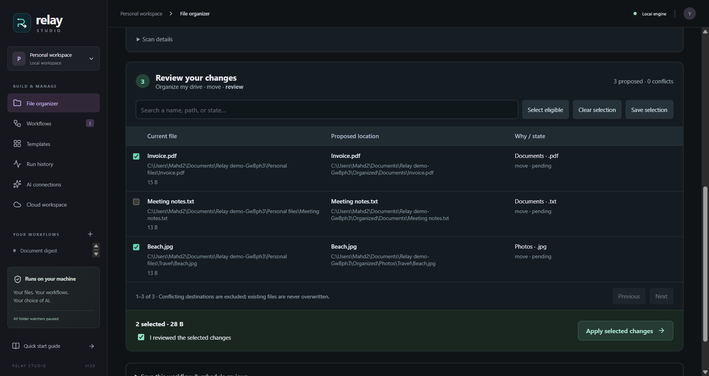
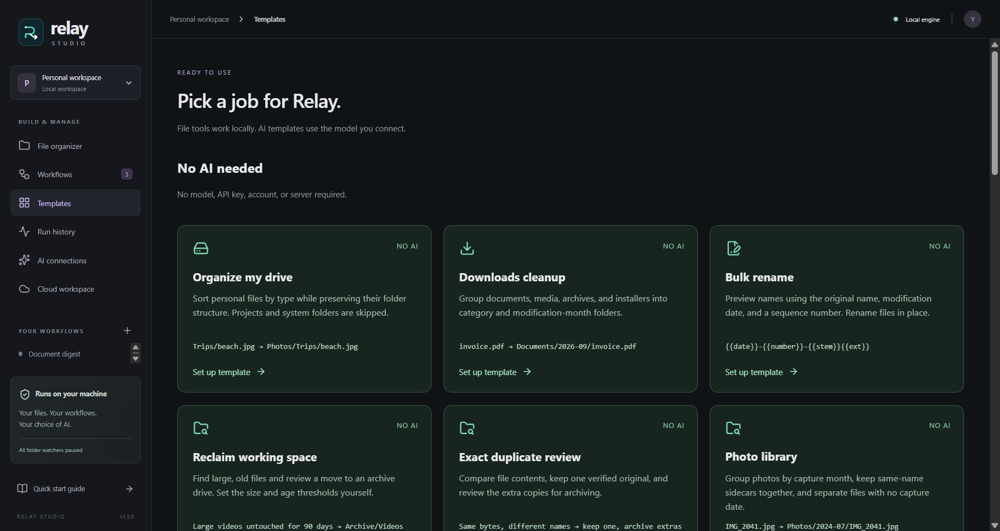
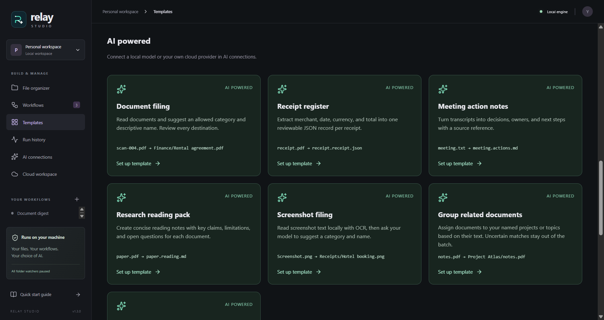
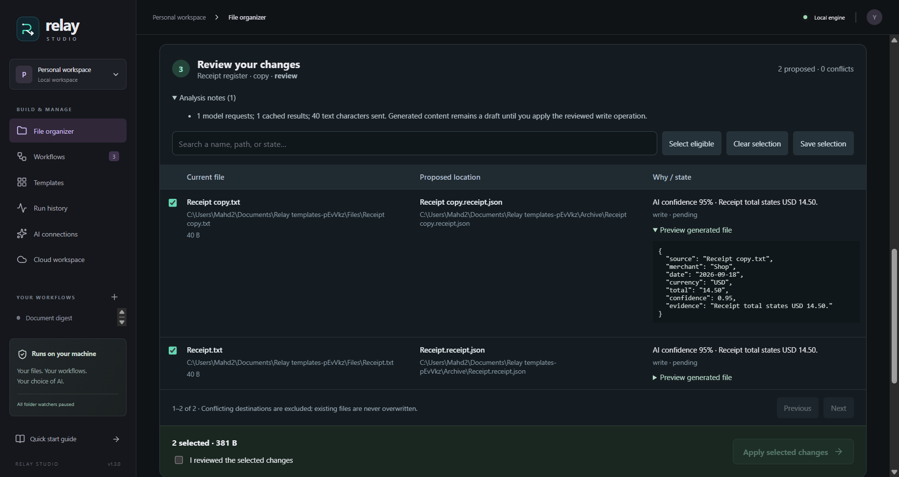

<p align="center">
  
</p>

<h1 align="center">Relay Studio</h1>

<p align="center"><strong>Organize existing files. Automate the ones that arrive next.</strong></p>

<p align="center">
  Scan a folder or data drive, review the changes, then copy, move, or rename the selected files. Use visual workflows for recurring tasks and optional AI.
</p>

<p align="center">
  <a href="https://github.com/Yaqoubj/Relay-Studio/releases/latest"></a>
  
  <a href="LICENSE"></a>
</p>

<p align="center">
  <a href="https://github.com/Yaqoubj/Relay-Studio/releases/latest"><strong>Download for Windows</strong></a>
  · <a href="docs/demo.md">Run the five-minute demo</a>
  · <a href="docs/architecture.md">Read the architecture</a>
</p>



## Two ways to work with files

**File organizer** handles files already on your computer. Scan a folder or data drive, choose rules, and review a table of original and proposed paths. Exclude individual files before applying the batch. Plans and operation records stay available after restarting the app.

**Workflows** handles repeatable steps: filter a file, move or rename it, extract text, ask a model, and write the result. Connect the blocks, test with one file, then run manually or watch a folder for arrivals.

### What is already working

- **Drive and folder scans** — inspect existing personal files recursively, with exclusions and category totals. System folders, links, dot paths, and recognized code projects are skipped.
- **Batch review** — inspect source and destination paths, reasons, name conflicts, selected size, and individual file states before making changes.
- **Nine no-AI templates** — drive organization, downloads cleanup, renaming, duplicate review, photo filing, archives, delivery preparation, storage review, and backup checks.
- **Seven AI templates** — document filing, receipt records, meeting notes, research notes, screenshot filing, topic grouping, and filing advice.
- **Local document reading** — text, DOCX, PDF, and English OCR for images or scanned PDF pages. Review generated content before writing it.
- **Saved setups and scheduled reviews** — reuse folder rules or have Relay prepare reviews at an interval while it is open.
- **Saved batch records** — keep plans locally, cancel between operations, and undo verified changes as a batch.
- **Visual workflow editor** — build flows from connected trigger, logic, file, AI, and notification blocks.
- **Folder automation** — react to new files after they finish copying, with a bounded sequential queue.
- **Existing-folder batches** — preview and organize files already in a folder, optionally including subfolders, with one history entry per file.
- **Safe file actions** — copy, move, rename, and write without silently overwriting existing files.
- **Preview before execution** — deterministic previews do not call AI. AI analysis asks for provider confirmation and leaves file changes pending review.
- **Execution history** — see the input, output, timing, status, and recorded file effects for every step.
- **Guarded undo** — restore supported file changes only when Relay can verify that the files were not modified.
- **Optional AI** — use local Ollama or an OpenAI-compatible HTTPS endpoint with your own model and key.
- **Portable workflows** — import and export recipes without leaking local folder paths or credentials.
- **Optional workspace sync** — connect to a local or self-hosted Relay API for accounts, workflow sync, share links, and run summaries.

<table>
  <tr>
    <td width="50%"></td>
    <td width="50%"></td>
  </tr>
  <tr>
    <td align="center"><sub>Every preview, manual run, and watched run is inspectable.</sub></td>
    <td align="center"><sub>Use a local API or point Relay at your own HTTPS deployment.</sub></td>
  </tr>
</table>

## Start with a real workflow

Run the source below or get a published Windows installer from [Releases](https://github.com/Yaqoubj/Relay-Studio/releases/latest). The installer is unsigned, so Windows may show a SmartScreen warning.

Start with **File organizer → Organize my drive**:

1. Browse to a personal folder and choose a separate destination.
2. Leave **Copy** selected to keep the originals, or choose **Move**.
3. Scan the files, then **Build review**.
4. Inspect both paths. Uncheck anything you want left alone, acknowledge the review, and apply the selected changes.
5. Open the saved batch and use **Undo batch** to reverse unchanged copies or moves. Created folders remain.

For whole-drive scans, select the drive root. Relay skips protected locations rather than rearranging the operating system. A scan stops at 50,000 files or 200,000 inspected entries; an incomplete scan cannot be applied. Scan smaller folders when needed. Put a `.relay-preserve` marker file in a folder to keep its entire tree untouched.

The template library separates tools that need AI from those that do not:

### No AI needed

| Template                   | What it does                                                                    |
| -------------------------- | ------------------------------------------------------------------------------- |
| **Organize my drive**      | Group personal files by type; optionally retain folder structure                |
| **Downloads cleanup**      | Sort into category and modification-month folders                               |
| **Bulk rename**            | Rename in place using original names, dates, and sequence numbers               |
| **Reclaim working space**  | Find files above a size and age threshold, then review an archive move          |
| **Exact duplicate review** | Compare hashes, retain a preferred copy, and archive selected extras            |
| **Photo library**          | File by capture month, keep same-name sidecars together, separate unknown dates |
| **Archive old files**      | Collect files older than a chosen modification age, retaining relative paths    |
| **Prepare a delivery**     | Copy selected files and write a checksum manifest                               |
| **Verify a backup**        | Compare hashes, propose missing copies, flag differences without overwriting    |



### AI powered

| Template                    | What it produces                                                   |
| --------------------------- | ------------------------------------------------------------------ |
| **Document filing**         | Suggested names and folders from an allowed category list          |
| **Receipt register**        | Reviewable JSON with merchant, date, currency, total, and evidence |
| **Meeting action notes**    | Markdown decisions, owners, deadlines, and open questions          |
| **Research reading pack**   | Reading notes with claims, limitations, and questions              |
| **Screenshot filing**       | Names and categories based on locally recognized screenshot text   |
| **Group related documents** | Filing suggestions for your named projects or topics               |
| **Organization adviser**    | Written filing recommendations; originals stay untouched           |





Collection templates use setup forms and a shared batch review. For connected block workflows, the editor includes **Download organizer**, **Document digest**, and **Meeting follow-up**. Graph workflows can also process an existing folder, up to 1,000 files per batch.

Folder watching starts paused after every app restart and only runs while Relay Studio is open.

## Choose your own AI

The no-AI templates need no model, API key, account, or server. AI templates use your configured provider.

For private local processing, install [Ollama](https://ollama.com), download a model, and enter its exact name under **AI connections**. Relay only accepts loopback addresses for Ollama.

For a cloud model, enter an OpenAI-compatible HTTPS base URL, model name, and your own API key. Cloud document processing stays disabled until you explicitly allow it. Keys are encrypted with the operating system credential store and never appear in workflow exports.

AI can return normal text or named fields such as `{{ai.company}}`. It cannot execute commands or access the filesystem. Only the action blocks already connected in the workflow can change files.

Collection analysis shows the provider and request limit before sending text. You set allowed categories, a confidence threshold, maximum files/requests (up to 100), and characters per file (up to 60,000). A batch also caps sent text at one million characters. These are usage limits, not a dollar-price guarantee. Cached results are reused for matching content, model, and instructions. Low-confidence suggestions are excluded from application.

OCR runs locally with a bundled English model; no separate service or runtime model download is needed. Extraction accepts files up to 25 MB and PDFs up to 20 pages. Generated notes are drafts to verify against the source. Screenshot filing reads text, not visual subjects in photos.

## Recurring reviews

Save a folder setup at the bottom of the organizer. No-AI setups can prepare reviews every 1–8,760 hours while Relay is open. Schedules wait during an active operation or folder watching. After a missed interval, Relay prepares one review instead of replaying every missed run. Applying file changes remains a separate action; AI analysis is manual.

## Run the workspace API where you want

The optional API in [`src/server`](src/server) adds accounts, personal workspaces, workflow sync, read-only share links, and compact run summaries. Desktop file execution stays on the desktop; local files and AI keys are not uploaded.

Organizer scans, plans, and batch journals currently stay on that desktop. The workspace API does not sync or execute them.

Run it directly:

```powershell
$env:RELAY_API_SECRET = 'use-a-random-value-at-least-32-characters-long'
npm run server
```

Or run the same API with Docker:

```sh
RELAY_API_SECRET=use-a-random-value-at-least-32-characters-long docker compose up -d --build
```

Connect the desktop app to `http://127.0.0.1:4317` for a local workspace. Remote endpoints must use HTTPS. API data is stored in `./data` by the included Docker Compose setup.

## Under the hood

```text
React + React Flow
        ↓ sandboxed preload bridge
Electron main process
        ├── scan → plan → review → batch executor
        └── validated graph → sequential workflow engine
                         ↓ SQLite journals
        ├── local filesystem
        ├── Ollama / HTTPS AI provider
        └── optional Relay workspace API
```

The renderer has no Node.js or filesystem access. Folder and file access starts with a native picker grant. Imported workflows have their folder paths cleared. Existing destination files are never overwritten. The execution engine rejects loops, joins, duplicate outputs, traversal filenames, symbolic-link inputs, and unsafe cloud endpoints.

The detailed failure model, watcher rules, preview semantics, and recovery limits are documented in [Architecture and tradeoffs](docs/architecture.md).

## Develop locally

Relay Studio currently targets Windows. You need Node.js 24+ and npm.

```sh
npm ci
npm start
```

```sh
npm test                  # engine, storage, API, PDF, and AI adapter tests
npm run test:e2e          # real Electron and filesystem integration tests
npm run build             # type-check and build the desktop app
npm run dist:installer    # produce the Windows installer
```

The test suite uses temporary folders and a controlled local AI server. It does not call a paid AI service.

Set `RELAY_UPDATE_SCREENSHOTS=1` before running the Electron tests to refresh documentation images. Normal tests leave them unchanged.

Build and publish a Windows release from a committed, pushed checkout:

```powershell
powershell -ExecutionPolicy Bypass -File scripts/release.ps1 -Publish
```

The script runs checks, builds the installer, verifies packaged PDF/OCR support, and uploads a draft before publishing. Retry an interrupted upload with `-Publish -UploadOnly`. Omit `-Publish` to build locally. The GitHub CLI must be signed into an account with release access.

## Current boundaries

Relay does not execute desktop jobs remotely or run as a background Windows service. Collection templates are not arbitrary graph blocks, project folders are preserved rather than compressed, and backup verification is not versioned disaster recovery. OCR currently covers English. There are no spreadsheet connectors, arbitrary scripts, graph loops, parallel branches, or team invitations. See [implementation scope](docs/roadmap.md) and [architecture](docs/architecture.md) for the operational limits.

## License

[MIT](LICENSE)
