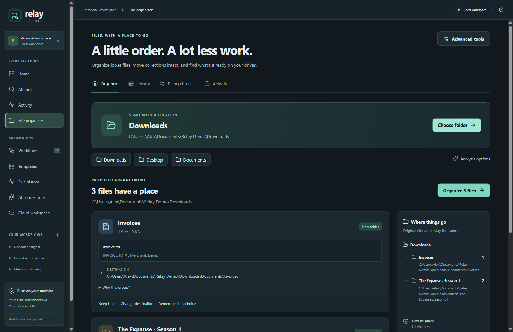
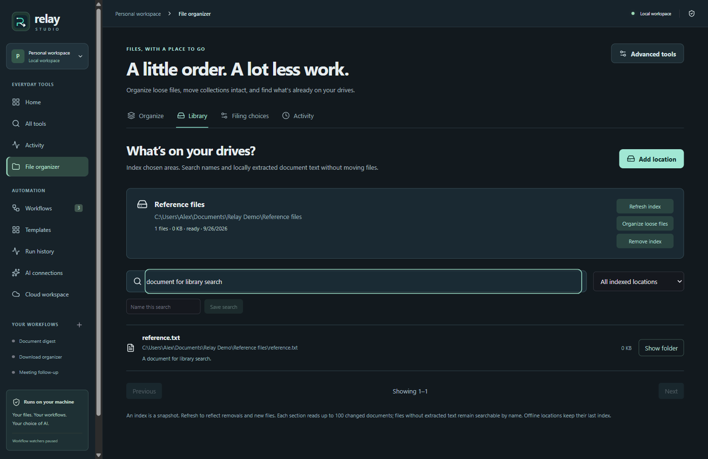

<p align="center"></p>
<h1 align="center">Relay Studio</h1>
<p align="center">Organize files. Work with pictures, PDFs, and text. Automate the repeat jobs.</p>
<p align="center"><a href="https://github.com/Yaqoubj/Relay-Studio/releases">Windows releases</a> · <a href="docs/demo.md">Try it</a> · <a href="docs/architecture.md">How it works</a> · <a href="LICENSE">MIT</a></p>

Relay is a Windows desktop app for everyday file work. The local tools need no account, server, or AI connection.

## File organizer

Choose a personal folder. Relay prepares collection cards with examples, destinations, and reasons. Keep a group where it is, change its destination, or organize the selected files. Original names stay the same.

| Tool              | What it does                                                                                                                                   |
| ----------------- | ---------------------------------------------------------------------------------------------------------------------------------------------- |
| Organize          | Group supported loose files, match episodes with subtitles, use photo capture dates, and reuse suitable existing folders.                      |
| Document evidence | Recognize invoices, receipts, contracts, meeting notes, and study material from local text clues. Optional AI can suggest one of those topics. |
| Filing choices    | Remember destinations for a particular source and collection. Edit, disable, prioritize, or delete them.                                       |
| Automatic filing  | Apply remembered choices to stable arrivals while Relay is open. Uncertain files wait in their original location.                              |
| Whole folder move | Move an explicitly selected personal collection with its contents and empty subfolders intact.                                                 |
| Library           | Index chosen folders or data drives. Search filenames and extracted document text, save searches, and keep the last index for offline drives.  |

Existing folders stay intact during ordinary organization. Recognized games, saves, applications, code projects, links, and unfinished downloads are held back. Collisions never cause an overwrite or automatic rename. File changes have a local journal and guarded undo.

A preparation covers up to 5,000 loose files and about 200 collections. Photo metadata, document reading, and existing-folder matching have bounded budgets. Larger libraries can be indexed in sections. See [architecture](docs/architecture.md) for the exact limits and recovery behavior.

## Everyday tools

Make pictures smaller, resize or convert them, create PDFs from pictures, merge PDFs, save selected pages, extract text, and clean pasted text. Outputs are copies in **Documents / Relay Results**. Open results, show their folders, or copy extracted text.

**Advanced tools** includes duplicate review, backup comparison, renaming, archives, delivery manifests, saved setups, and specialized document tools. The visual workflow editor connects file actions, conditions, document reading, optional AI, and notifications. Graph watchers start paused after restart.

## Optional AI and workspace API

Use a local Ollama model or your own OpenAI-compatible HTTPS endpoint and API key. Cloud processing requires an explicit opt-in. The model suggests content; it cannot execute commands or choose unrestricted filesystem paths. OCR uses the bundled English model. Embedded Arabic text can be read; Arabic image OCR is not included.

The optional workspace API adds accounts, workflow sync, share links, and compact run history. Run it locally or on your own server. Desktop execution, organizer journals, filing rules, and indexes stay on the computer.

```powershell
$env:RELAY_API_SECRET = 'replace-with-a-random-secret-at-least-32-characters-long'
npm run server
```

Connect to `http://127.0.0.1:4317` locally. Remote connections require HTTPS. [Docker setup](docker-compose.yml) uses the same API.

## Run from source

Node.js 24+ and npm are required.

```powershell
npm ci
npm start
```

```powershell
npm test
npm run test:e2e
npm run build
```




The source passes the production build, 58 unit tests, and 7 desktop end-to-end tests. The installer and release have not been built or published.

For a verified, committed, and pushed checkout, the owner can build and publish the Windows installer:

```powershell
powershell -ExecutionPolicy Bypass -File scripts/release.ps1 -Publish
```

The script runs checks, builds and inspects the packaged app, then uploads a draft before publishing. Use `-Publish -UploadOnly` to retry a verified interrupted upload. The installer is unsigned.

## Limits

Relay runs while the desktop app is open. It is not a Windows service, remote disk worker, or versioned backup system. Related file moves are journaled sequentially; they are not an atomic filesystem transaction. Edited outputs and uncertain crash states stop automatic undo. Indexes, paths, document excerpts, and journals are stored locally in plaintext; AI credentials use the operating system credential store.
