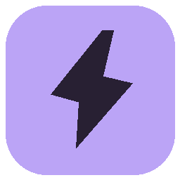

# Relay Studio

<p align="center"></p>
<p align="center">A small desktop app for turning repetitive file work into visual workflows.</p>
<p align="center"><a href="https://github.com/Yaqoubj/Relay-Studio/releases">Download</a> · <a href="docs/demo.md">Demo</a> · <a href="docs/architecture.md">Architecture</a></p>


I started this because I kept seeing the same desktop task: wait for a file, check what it is, rename it, move it, and maybe pull some information out of it. I wanted something easier to understand than another script, but much smaller than a full automation platform.

Relay Studio lets you build that process with connected blocks. It runs locally as an Electron app. There is no account, backend, or required AI service.

## What it can do

The included templates are:

- **Download organizer:** watch a folder, keep PDFs, move them to an archive, add today’s date, and show a notification.
- **Document digest:** read a text-based PDF, ask AI for a summary, and save a Markdown file.
- **Meeting follow-up:** read a transcript and create notes with decisions and action items.

You can edit the templates or build a workflow from scratch. The blocks handle folder triggers, conditions, reading text, AI transforms, copying, moving, renaming, writing files, and notifications.

Before a real run, you can use **Preview**. It reads the sample file and shows the planned steps without changing files or calling AI. Real runs are recorded in the execution history, including each step’s output and timing. Supported file changes can be undone if the files have not been changed since the run.


## Try it

Download the Windows installer from the [Releases page](https://github.com/Yaqoubj/Relay-Studio/releases). It is unsigned, so Windows may show a warning.

For the quickest test:

1. Open **Download organizer**.
2. Choose an input folder and an archive folder.
3. Save the workflow.
4. Click **Test workflow**, pick a sample PDF, and run Preview.
5. Run it for real if the plan looks right.

Folder watching is off until you enable it. It only runs while Relay Studio is open.

## AI setup

AI is optional. The file-moving examples do not need it.

For local AI, install [Ollama](https://ollama.com), download a model, and enter its name under **AI connections**. The default local address is `http://127.0.0.1:11434`.

For cloud AI, enter an HTTPS endpoint, a model name, and your own API key. You also have to enable document processing before Relay sends extracted text to that provider. API usage is billed by the provider; a ChatGPT subscription does not automatically include API access.

AI steps can return normal text or named fields. Later steps can use values such as `{{ai.company}}`. If the response is not valid, the run stops instead of guessing. AI cannot execute shell commands; it only supplies text to the blocks you configured.

## Run from source

You need Node.js 24+ and npm. Windows is the platform I have tested.

```sh
npm ci
npm start
```

Useful commands:

```sh
npm test                  # engine, storage, PDF, and AI adapter tests
npm run test:e2e          # real Electron and filesystem tests
npm run build             # type-check and build the app
npm run dist:installer    # build the Windows installer
```

The tests use temporary folders and a controlled local AI server. They do not call a paid AI service.

## How it is built

The interface is React and React Flow. The execution engine is TypeScript code in the Electron main process. SQLite stores workflows and run history. Chokidar watches folders. PDF text is extracted with `pdf-parse`.

The renderer is sandboxed and only gets the specific capabilities exposed through the preload bridge. API keys are stored with the operating system credential store. Exported workflows do not include folder paths or credentials.

The [architecture notes](docs/architecture.md) explain the graph rules, preview behavior, file safety checks, and recovery limits.

## What is still missing

This is a portfolio project, not a finished automation product. It currently does not have schedules, OCR, arbitrary scripts, spreadsheet integrations, cloud sync, team accounts, loops, parallel branches, or a background service that runs after the app closes.

Watching starts paused after a restart. Undo only covers unchanged file operations. A crash between a filesystem change and its history entry can still leave work that needs manual inspection. Run history stores paths and short document excerpts locally in plain text. The installer is unsigned.

Those limits are intentional for now. I wanted the core workflow, preview, safety checks, and execution history to work before adding more integrations.

## Project history

This repository started as OverlayAI, a floating wrapper around AI websites. I changed the direction because that idea did not say much about my engineering or product thinking. Relay Studio is the replacement. The old source is still under `src/main`, `src/renderer`, and `native` for reference, but it is not part of the Relay Studio build.

## License

[MIT](LICENSE).
