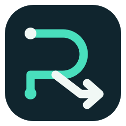
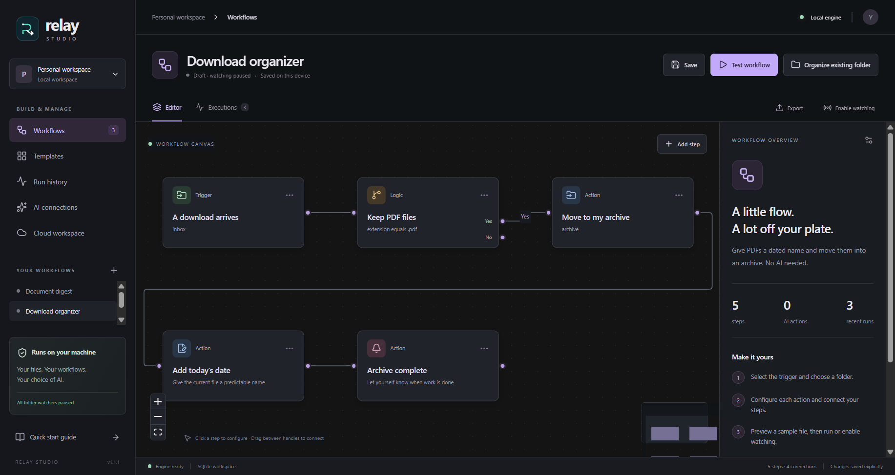
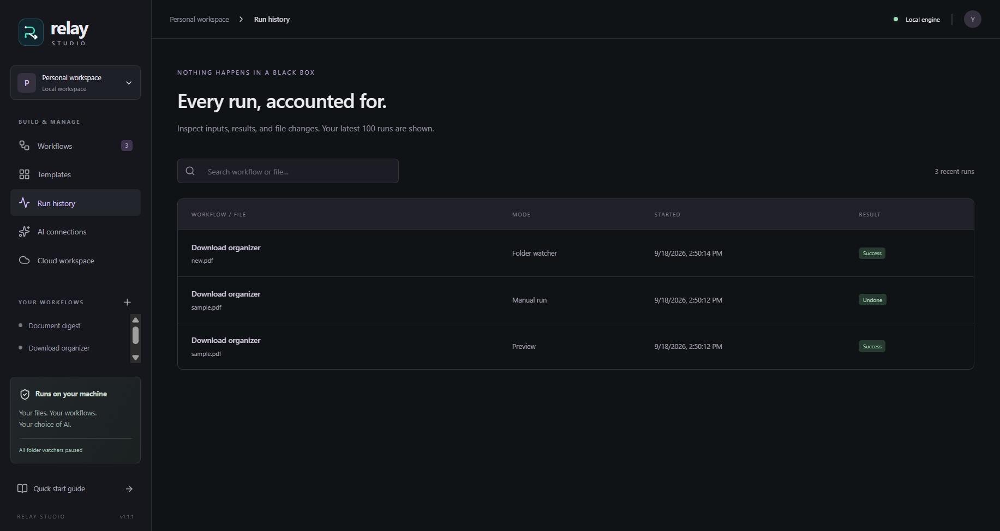
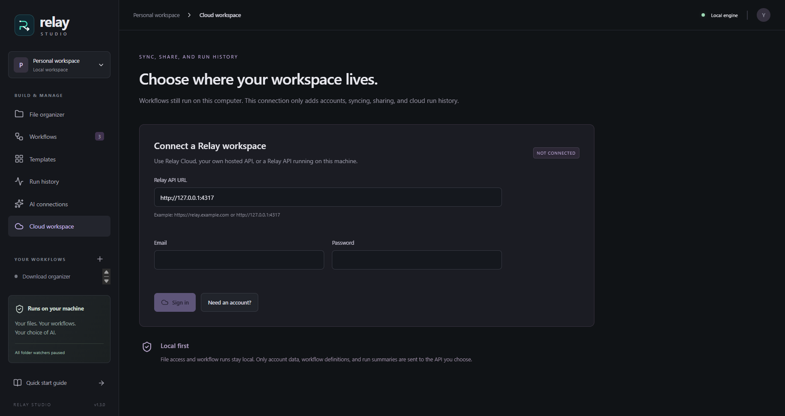

<p align="center">
  
</p>

<h1 align="center">Relay Studio</h1>

<p align="center"><strong>Desktop automation for the files that keep landing in your folders.</strong></p>

<p align="center">
  Watch a folder, route the right files, rename them, extract text, ask AI, write the result, and keep a record of every run.
</p>

<p align="center">
  <a href="https://github.com/Yaqoubj/Relay-Studio/releases/latest"></a>
  
  <a href="LICENSE"></a>
</p>

<p align="center">
  <a href="https://github.com/Yaqoubj/Relay-Studio/releases/latest"><strong>Download for Windows</strong></a>
  · <a href="docs/demo.md">Run the five-minute demo</a>
  · <a href="docs/architecture.md">Read the architecture</a>
</p>



## Build it once. Let the folder handle the rest.

Relay Studio turns repetitive desktop file work into a visual workflow. Connect a trigger to conditions and actions, preview the route on one file, then run it manually or leave the folder watcher on.

This is a working Electron application, not a workflow mockup. It watches real folders, performs guarded filesystem operations, records every step in SQLite, and can reverse supported file changes when the files are still untouched.

### What is already working

- **Visual workflow editor** — build flows from connected trigger, logic, file, AI, and notification blocks.
- **Folder automation** — react to new files after they finish copying, with a bounded sequential queue.
- **Existing-folder batches** — preview and organize files already in a folder, optionally including subfolders, with one history entry per file.
- **Safe file actions** — copy, move, rename, and write without silently overwriting existing files.
- **Preview before execution** — inspect deterministic steps without writes, notifications, or AI calls.
- **Execution history** — see the input, output, timing, status, and recorded file effects for every step.
- **Guarded undo** — restore supported file changes only when Relay can verify that the files were not modified.
- **Optional AI** — use local Ollama or an OpenAI-compatible HTTPS endpoint with your own model and key.
- **Portable workflows** — import and export recipes without leaking local folder paths or credentials.
- **Optional workspace sync** — connect to a local or self-hosted Relay API for accounts, workflow sync, share links, and run summaries.

<table>
  <tr>
    <td width="50%"></td>
    <td width="50%"></td>
  </tr>
  <tr>
    <td align="center"><sub>Every preview, manual run, and watched run is inspectable.</sub></td>
    <td align="center"><sub>Use a local API or point Relay at your own HTTPS deployment.</sub></td>
  </tr>
</table>

## Start with a real workflow

Download the current Windows installer from [Releases](https://github.com/Yaqoubj/Relay-Studio/releases/latest). The installer is unsigned, so Windows may show a SmartScreen warning.

The fastest useful test is the included **Download organizer**:

1. Choose a folder to watch and a separate archive folder.
2. Save the workflow and select **Test workflow**.
3. Pick one PDF and run **Preview** to inspect the planned route.
4. Run it for real. Relay moves the file, adds today’s date, and records the execution.
5. Use **Undo files** to restore it while the file is still unchanged.

For files already sitting in a folder, choose **Organize existing folder**, select the folder, optionally include subfolders, preview the batch, and run it. Relay processes files sequentially, excludes configured output folders, and records each file separately.

Three editable workflows ship with the app:

| Workflow               | What it demonstrates                               | AI required |
| ---------------------- | -------------------------------------------------- | ----------- |
| **Download organizer** | Filter PDFs, move them, add a date, and notify     | No          |
| **Document digest**    | Read a text-based PDF and write a Markdown summary | Yes         |
| **Meeting follow-up**  | Turn a transcript into decisions and action items  | Yes         |

Folder watching starts paused after every app restart and only runs while Relay Studio is open.

## AI is a block, not the whole product

All file organization features work without an AI account.

For private local processing, install [Ollama](https://ollama.com), download a model, and enter its exact name under **AI connections**. Relay only accepts loopback addresses for Ollama.

For a cloud model, enter an OpenAI-compatible HTTPS base URL, model name, and your own API key. Cloud document processing stays disabled until you explicitly allow it. Keys are encrypted with the operating system credential store and never appear in workflow exports.

AI can return normal text or named fields such as `{{ai.company}}`. It cannot execute commands or access the filesystem. Only the action blocks already connected in the workflow can change files.

## Run the workspace API where you want

The optional API in [`src/server`](src/server) adds accounts, personal workspaces, workflow sync, read-only share links, and compact run summaries. Desktop file execution stays on the desktop; local files and AI keys are not uploaded.

Run it directly:

```powershell
$env:RELAY_API_SECRET = 'use-a-random-value-at-least-32-characters-long'
npm run server
```

Or run the same API with Docker:

```sh
RELAY_API_SECRET=use-a-random-value-at-least-32-characters-long docker compose up -d --build
```

Connect the desktop app to `http://127.0.0.1:4317` for a local workspace. Remote endpoints must use HTTPS. API data is stored in `./data` by the included Docker Compose setup.

## Under the hood

```text
React + React Flow
        ↓ sandboxed preload bridge
Electron main process
        ↓ validated workflow graph
Sequential file engine ─── SQLite run journal
        ├── local filesystem
        ├── Ollama / HTTPS AI provider
        └── optional Relay workspace API
```

The renderer has no Node.js or filesystem access. Folder and file access starts with a native picker grant. Imported workflows have their folder paths cleared. Existing destination files are never overwritten. The execution engine rejects loops, joins, duplicate outputs, traversal filenames, symbolic-link inputs, and unsafe cloud endpoints.

The detailed failure model, watcher rules, preview semantics, and recovery limits are documented in [Architecture and tradeoffs](docs/architecture.md).

## Develop locally

Relay Studio currently targets Windows. You need Node.js 24+ and npm.

```sh
npm ci
npm start
```

```sh
npm test                  # engine, storage, API, PDF, and AI adapter tests
npm run test:e2e          # real Electron and filesystem integration tests
npm run build             # type-check and build the desktop app
npm run dist:installer    # produce the Windows installer
```

The test suite uses temporary folders and a controlled local AI server. It does not call a paid AI service.

## Current boundaries

Relay does not yet include schedules, OCR, spreadsheet integrations, arbitrary scripts, loops, parallel branches, team invitations, or a background Windows service. The workspace API uses SQLite and does not remotely execute desktop file workflows. A production-hosted service would also need HTTPS termination, managed authentication, a production database, and durable background jobs.

## License

[MIT](LICENSE)
