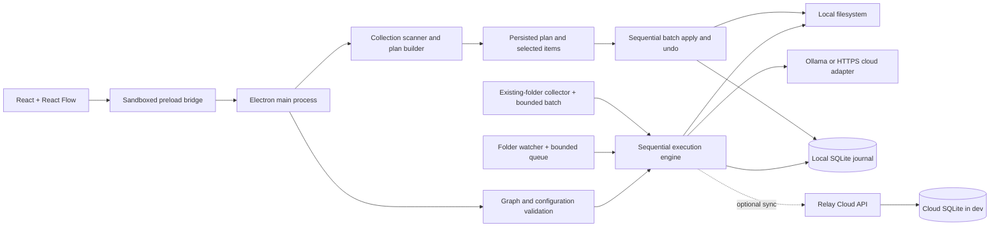

# Architecture and tradeoffs

Relay Studio is a local desktop workflow engine with a visual editor. React Flow supplies the canvas; it does not execute workflows. The application owns the graph format, runtime, permissions, persistence, and recovery behavior.

## Boundaries

The renderer has no Node.js or filesystem access. IPC verifies the sending frame and its local page URL. Native folder pickers create persistent canonical-folder grants. Manual input files require a file-picker grant for the current session. Imported recipes have all folder fields reset. Exported recipes omit folder paths and never contain connection credentials. The optional API owns accounts, workspaces, synced workflows, share links, and compact run summaries. The desktop client sends workflow definitions to the API; those definitions can include configured folder path strings. It sends run source names rather than full source paths, and it does not upload file contents or AI keys.

The Content Security Policy blocks renderer network access, remote scripts, frames, and embedded objects. All AI networking happens in the main process. Navigation and new windows are blocked.

## Graph semantics

Each workflow has one trigger and at most 40 steps. A normal output has one successor; conditions have separate Yes and No outputs. An unconnected condition output ends that path successfully. Cycles, joins, duplicate IDs, and multiple successors on the same output are rejected. Drafts may contain disconnected steps, but execution requires every step to be reachable from the trigger.

One run executes at a time. Each run captures the workflow version, source path, mode, timestamps, per-step input/output, duration, and file effects. Edits do not rewrite history. The UI reads snapshots and receives update events through IPC. Cancel aborts an AI request or stops before the next step; file operations already in progress finish.

## Existing files and batches

There are two execution paths. **File organizer** works on a collection-wide plan. The workflow editor's folder batch runs one graph independently for each file.

### Collection organizer

`src/shared/organizer.ts` defines scan and plan records, per-file states, saved setups, a general organizer in No AI and With AI modes, and specialized tools. `src/desktop/organizer.ts` scans, plans, applies, and undoes them; `smart-organizer.ts` composes general local grouping with bounded AI document suggestions; `collection-analysis.ts` supplies specialized analysis. `src/studio/Organizer.tsx` supplies setup forms, exclusions, category counts, grouped review, searchable rows, selection, generated-content previews, progress, and saved batch access. Collection plans remain separate from the graph schema.

Scanning is read-only and metadata-based. It collects regular file paths, sizes, modification times, device/inode identities, and extension categories. Directory traversal skips links/junctions, hard-linked files, dot paths, named system/application locations, explicit exclusions, and folders containing recognized project markers or `.relay-preserve`. These are conservative name/marker rules, not a universal detector of every application folder or Windows hidden attribute. Unreadable entries are reported and skipped. Scans pause between completed directories after roughly 50,000 files or 200,000 visited entries; a very large single directory can exceed those targets. The pending directory list is saved, and the general organizer can review the completed section before continuing. Specialized tools still require a complete scan. One most recent scan section, including its settings, is saved locally.

Planning resolves every destination without changing files. The general organizer can plan moves inside the source folder, into a new subfolder, or into another selected folder. It recognizes TV episode patterns and subtitles, groups photos by screenshot names, filename families, small visual thumbnail similarity, or modified month, and groups other files by type. Visual grouping compares at most 500 photos per scan section using a 9-by-8 difference hash and average color, within the same modified month. This proposes groups only; it does not identify exact duplicates or understand image subjects. Managed output folders are skipped on later scans so repeat runs do not nest them again. Existing destinations and duplicate proposed destinations are flagged and deselected; there is no automatic overwrite or suffix decision. Other specialized tools retain their own destination rules.

Specialized analyzers implement distinct rules:

- Storage cleanup composes exact duplicate review with age/size filtering. The kept copy of each duplicate group is excluded from storage moves, so later duplicate checks retain a stable keeper.
- Combine collections uses the general organizer with a separate library destination. Prepare to share copies selected files with a checksum manifest; private-looking filenames are unselected by default and must be reviewed before inclusion.

- Storage and age-based archives filter by size/modification age and retain relative paths. They do not compress projects.
- Duplicate review groups by size then SHA-256. The preferred keep folder wins, followed by relative-path order. Every extra copy references a retained file whose identity/hash is rechecked before execution; extras are copied/moved to an archive, never directly deleted.
- Photo filing reads EXIF with `exifr`, groups same-basename RAW/JPEG and `.xmp`/`.aae` sidecars, and uses capture calendar dates. Unreadable/missing metadata produces an explicit Unknown capture date folder. A user can deselect any item, so preserving complete groups also depends on review selection.
- Backup comparison hashes relative-path pairs, skips exact matches, flags different existing targets, and proposes only missing copies. Extra backup files are untouched. Delivery copies retain relative paths and add a checksum manifest regenerated from selected, conflict-free items.
- AI analysis proposes allowed category/name changes or exclusive JSON/Markdown writes. Each generated item retains its source identity/hash and content for inspection. The executor checks that the source still matches analysis before using it.

The main process holds the authoritative plan; the renderer sends settings and selected IDs, never an executable list of arbitrary paths. Source and external output roots require native picker grants; internal outputs derive from the source grant. All watchers must be paused. A shared active-operation lock prevents graphs and collection operations from executing together, including during the confirmation dialog. Progress uses a throttled IPC event instead of repeatedly sending the entire collection.

Apply rechecks every selected source identity and target path before the first write. It then processes files sequentially, records the intended operation, copies exclusively, verifies SHA-256 hashes, and removes the original only for a verified move. Hashing streams data, so this path is not restricted by the graph engine's 25 MB document limit. Cancellation interrupts scanning/hashing or stops between operations; an in-flight copy is allowed to finish. Errors stop the batch. Completed effects stay in the journal for inspection and undo. Applying the same executed plan again is rejected; create a new scan and review instead.

Generated writes use exclusive creation and a content hash, then follow the same journal/undo path as copies. Copies and restored originals retain modification time; platform-specific ACLs, alternate streams, and extended attributes are not a complete backup contract.

`organization_plans` stores metadata and `organization_items` stores ordered per-file records in SQLite. Each state update commits the changed item and plan metadata together, avoiding serialization of the entire batch for every copied file. Selection changes replace the item records transactionally. Plans use `review`, `running`, `complete`, `cancelled`, `failed`, `interrupted`, `undoing`, and `undone` states. Startup marks running/undoing plans interrupted. This history is local and separate from graph run history and optional cloud sync.

Undo walks completed items in reverse. It verifies output hashes, refuses occupied original paths, restores moved files exclusively, and removes only the verified output. Changes made after execution stop undo. Newly created folders are journaled and removed on undo only when empty. Uncertain crash states (`copying`, `removing`, `restoring`, `undo-removing`) block automated undo and require manual inspection: the app never guesses which file it owns. SQLite and filesystem operations are not a single transaction; concurrent external writers can still race filesystem checks.

### Graph folder batches

The editor can process files already present in a selected folder through **Organize existing folder**. The desktop process collects the input list before execution, skips symbolic links, excludes configured output folders, optionally walks subfolders, and caps a batch at 1,000 files. It processes files sequentially through the same engine used by a manual run, so every file receives its own run record and supported effects can be undone individually.

The batch pauses if a file fails or the user cancels. This prevents a collision or configuration mistake from multiplying across the rest of the folder. Folder containers are never moved by the collector; only the workflow's file actions decide where each file goes. A preview still performs no writes, notifications, or AI requests. The list is collected before the first file runs, so newly created output cannot be picked up by the same batch.

All watchers must be paused before a batch starts. Existing-folder processing is a desktop feature and does not make the optional API a remote execution worker.

## Preview

Preview reads and extracts the selected file, evaluates deterministic conditions, and resolves filenames. It performs no file writes, notifications, or AI requests. AI-dependent output is explicitly unresolved. If an AI-dependent branch or rename prevents a reliable downstream plan, preview stops rather than inventing data.

A successful preview is a simulation result, not proof that an AI provider is configured or that a subsequent real run will succeed. Files and permissions may change between preview and execution.

## Files and recovery

The graph engine supports copy, move, rename, and exclusive text-file creation. Existing destinations are never overwritten. Filenames reject separators, traversal, control characters, and Windows reserved names. Symbolic-link inputs are rejected by the engine. Each graph input file has a 25 MB limit; collection organizer copies/moves use streaming hashes and do not have that limit.

Moves use exclusive copy, hash verification, and source removal, supporting cross-volume moves. Effects are recorded in SQLite as execution progresses. Undo walks those effects backwards, verifies content hashes, refuses conflicting restore paths, and persists partial undo progress. Modified files are not removed by undo. Notifications and AI requests cannot be reversed.

Filesystem operations and SQLite updates are not one transaction. A process or power failure between a filesystem operation and its journal update can leave an unjournaled effect. Interrupted runs are marked on startup; inspect their paths before rerunning. This version does not claim crash-atomic or exactly-once filesystem execution. It also cannot eliminate races caused by other programs editing the same files concurrently.

## Watching

Chokidar watches only files directly inside the chosen folder. Existing files are ignored and new files must stabilize for 1.5 seconds. Symbolic links are not followed. A bounded queue holds up to 100 arrivals and runs them sequentially; an overflow notification tells the user to process missed files manually.

Watchers start paused after restart. Editing a watched workflow pauses it. Watching does not run when the application is closed. A move must precede a rename in watched workflows, outputs must be outside their source folder, and chains between active watched folders are blocked to avoid loops. Queue contents are not persisted across restarts. A failed run remains in history; no automatic retry risks repeating effects.

## AI

Ollama is restricted to loopback addresses. Cloud providers must use HTTPS and the OpenAI-compatible Chat Completions schema. Redirects are rejected. Cloud document processing requires an explicit setting. Requests have a 120-second timeout and a 60,000-character text limit.

API keys are encrypted using Electron safeStorage and are never returned to the renderer. Insecure plaintext storage backends are rejected. Changing the endpoint without supplying a replacement key clears the old key. Model names are entered explicitly; the app does not download models or subscribe users to services.

Structured output requires user-selected string fields. Missing fields or invalid JSON fail the step. Model output cannot execute tools or shell commands. It can influence configured templates, where safe filename checks still apply. Empty field values are allowed and should be considered when designing naming patterns.

Collection AI uses bounded extraction in `documents.ts`: text formats, DOCX through Mammoth raw-text extraction, PDF text through pdf-parse, and Tesseract.js OCR for images or PDF pages with no extractable text. Inputs cap at 25 MB and PDFs at 20 pages. OCR uses a bundled English trained-data package, a worker with a 120-second limit, and termination on cancellation. It needs no runtime language download. OCR is text recognition, not image-subject understanding.

Before analysis the main process shows the provider, model, endpoint, and request/text budget. Cloud processing still requires the global opt-in and credential. Up to 100 files/requests, 60,000 characters per document, and 1,000,000 submitted characters per batch are allowed. Excess files and extraction failures appear in analysis notes; text is not silently truncated. Provider failures stop further requests. Model confidence is a self-reported hint, not a calibrated probability. Required fields, category allowlists, safe names, receipt field formats, and a user-selected confidence threshold gate proposed operations. JSON/Markdown is shown as plain text before writing.

The local `organization_ai_cache` table retains at most 500 results, keyed by source hash, model/provider/endpoint, prompt/schema, extraction settings, and limits. Failed validation is not cached. This avoids repeated model calls without trusting a stale source. Results and generated drafts are plaintext local data, as are other journal contents. The cache is not synced to the workspace API. Changing credentials alone does not change cache identity; changing model, endpoint, prompt, or content does.

Implementation references: [Tesseract local installation](https://github.com/naptha/tesseract.js/blob/master/docs/local-installation.md), [Mammoth raw text](https://github.com/mwilliamson/mammoth.js), and [exifr](https://github.com/MikeKovarik/exifr).

## Scheduled reviews

`maintenance.ts` claims one due saved setup at a time. Its next timestamp and an unfinished-run message are persisted before scanning. A 30-second desktop timer calls the queue only when no graph/organizer operation or watcher is active. On restart an overdue schedule runs once, with the next due time measured from that run; missed intervals are not replayed. Errors are recorded and reported, without automatic immediate retries. Manual saved setups can use AI after confirmation; enabled schedules cannot use AI. Scheduled results are plans awaiting review, never automatic file actions. Schedules require the running desktop application and are unrelated to cloud job dispatch.

## Storage and limits

SQLite uses WAL mode. Workflow saves and run-journal updates are individual database transactions. The history UI shows the latest 100 runs; older records remain on disk. Document excerpts (up to 5,000 characters per step), paths, and prompts are stored locally in plaintext. Credentials are encrypted, not the entire workspace. Quit the application before backing up the user-data directory, including any remaining WAL files.

The app has no remote desktop-file execution, background Windows service, arbitrary scripts, parallel graph branches, loops, spreadsheet connector, or team invitations. The backend supports accounts, graph-workflow sync, sharing, and run summaries. Remote execution would require a separate authenticated worker/dispatch design. Windows is the tested distribution target. `RELAY_DATA_DIR` can point both development and packaged builds at an isolated local workspace; packaged smoke tests use it instead of touching personal data.
