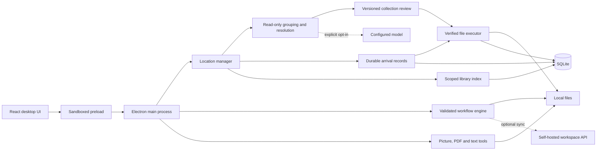

# Architecture

Relay Studio uses Electron, React, TypeScript, and local SQLite. React Flow supplies the optional workflow canvas. The application owns execution, permissions, persistence, and recovery. No competitor runtime, server, or model is bundled into the organizer.

## Process boundaries

The renderer has no Node or filesystem access. IPC accepts requests only from the main window's local page. Navigation, extra windows, renderer network requests, and permission requests are blocked. Native folder selection creates a canonical persistent grant. Downloads, Desktop, and Documents shortcuts open the native picker at Electron's actual OS location; showing a shortcut does not grant access. Imported graph recipes have folder paths cleared. Exported recipes omit paths and credentials.

One active-operation lock covers preparation, choice changes, execution, undo, indexing, graph runs, and automatic filing. Graph watchers must be paused before collection work. Progress events are throttled separately from state snapshots. Quit cancels an active operation at its supported cancellation boundary.

## Primary organizer

`src/shared/organize-location.ts` defines collection cards, remembered filing choices, arrival records, folder manifests, and indexed library records. `OrganizeLocation.tsx` supplies the primary Organize, Library, Filing choices, and Activity screens. `Organizer.tsx` supplies specialized tools under Advanced. There is one file executor and operation journal for both routes.

`src/desktop/organize-location.ts` prepares the direct flow:

1. Resolve and inspect the granted source. Scan only immediate loose files; existing folders are not flattened.
2. Inspect bounded folder context inside the grant for compatible destinations.
3. Recognize supported episodes and exact companion stems, including language variants. Recognize photo basename pairs and sidecars. Read capture dates and bounded document evidence.
4. Group independent related sets into collection cards. Resolve remembered or existing destinations. Keep ambiguity, unsupported files, and conflicts pending in place.
5. Construct a version 2 plan, then persist it without changing files.

`location-manager.ts` owns current-review identity, revisions, destination changes, filing rules, automatic arrivals, folder bundles, and library indexing. Renderer requests carry IDs and choices, not executable source/destination lists. A group change increments the revision. Apply checks the current ID/revision again after awaited permission checks. Rule edits invalidate the outstanding revision; they affect grouping when a location is prepared again.

### Grouping and destinations

Episode recognition requires a supported video extension. Matching subtitles and known sidecars share a related-set ID with their episode. Unknown episode-looking extensions remain unsupported. A category group can contain multiple independent related sets, but the main executor rejects partial selection of any selected set.

Photos use EXIF `DateTimeOriginal`, with local calendar year/month semantics. A new month folder requires at least three distinct picture stems. Missing capture dates use the general picture folder; modification time is not presented as capture time. Same-basename RAW/JPEG/XMP/AAE files travel together. Conflicting capture months hold a pair back. The primary flow does not claim image-subject recognition or exact duplicates from visual similarity.

Supported documents use two local text signals for a narrow set of topics: invoices, receipts, contracts, meeting notes, and study material. The UI exposes sample text and the grouping reason. Optional AI can suggest only one of those topics, with a self-reported confidence of at least 0.85. It cannot supply paths or commands. A failed suggestion falls back to local file-type evidence. This is bounded classification, not a universal understanding of a user's work.

Explicit destination choices take precedence. Remembered choices match an exact source and collection key; the highest priority wins, and equal conflicting priorities require user resolution. Rules retain examples, an approved root's device/inode identity, and a relative target path. Missing or replaced remembered roots remain pending. Suitable existing collection folders are reused; candidate matching is restricted to recognized collection/library context. Ambiguous matches are not silently merged. Re-running an organized location does not intentionally add another category tree.

### Limits

| Operation               | Current implementation budget                                                                                                           |
| ----------------------- | --------------------------------------------------------------------------------------------------------------------------------------- |
| Direct preparation      | First 5,000 loose files; roughly 200 collection cards, with further distinct collections held back                                      |
| Existing-folder context | At most 2,000 eligible folders, four levels; metadata only                                                                              |
| Photo capture dates     | First 500 pictures                                                                                                                      |
| Local document evidence | First 40 documents                                                                                                                      |
| Optional image OCR      | Up to five pictures, English model                                                                                                      |
| Optional model analysis | Up to 20 requests, at most 12,000 submitted characters each                                                                             |
| Detail/thumbnail IPC    | 100 file rows per request; UI requests at most 12 representative thumbnails sequentially                                                |
| Whole-folder manifest   | At most 20,000 entries; at most 10 explicitly selected top-level collections                                                            |
| Library                 | Up to 20 indexed locations; directory sections near 50,000 files or 200,000 entries; 100 readable-document attempts per section/refresh |
| Search                  | 100 results per page; 200-character query; up to 50 saved searches                                                                      |
| Automatic filing        | Up to 10,000 loose files in each monitored source                                                                                       |
| Histories               | Latest 200 organization batches shown; records are not deleted by this display limit                                                    |

A huge individual directory can exceed a library section target because section boundaries occur after directories. Directory scans still use in-memory sections. The persistent library is disk-backed, but this is not an unbounded streaming scanner. Additional documents without extraction remain name-searchable; subsequent refreshes attempt those not yet read. Document extraction accepts regular files up to 25 MB and PDFs up to 20 pages. Oversized/unreadable content falls back to file-type evidence. These are implementation budgets, not measured speed or memory guarantees.

## File protection and execution

`file-policy.ts` checks all actual ancestor directories for recognized project/application/game markers, managed names, and preservation markers. It is shared by scanning and mutations, with directory evidence cached per operation. The policy is conservative and cannot identify every application's data. Code projects and application/game trees remain protected even during explicit collection relocation.

Scanners exclude links/junctions, hard-linked files, protected names, dot paths, known save extensions, and explicit exclusions. Unreadable or excluded entries carry reasons. A `.relay-preserve` marker preserves its tree. Permission to inspect a folder never overrides these checks.

Version 1 plans keep their single-root contract for specialized tools. Version 2 plans carry an approved root map and an explicit root reference on each item. The main process verifies grants; the executor verifies containment, root identity, protected context, path ancestry, and each source's size, timestamp, device, and inode. Unknown versions/references fail. Both apply and undo enforce recorded boundaries.

Before the first write, the executor preflights all selected files. It rechecks identities and paths per operation, creates destinations exclusively, hashes source/output, and removes a source only after verified copying. No automatic overwrite, suffix, or rename resolves collisions. A related group is not a filesystem transaction: cancellation or a failure can leave a partially completed set, accurately recorded in the journal. In-flight copies finish; scanning, extraction, and hashing honor cancellation where supported.

Undo verifies output hashes, refuses occupied original file paths, restores exclusively, and removes only verified outputs. Run-created directories are removed only when empty. The executor does not delete newly encountered source folders during ordinary organization. File ACLs, alternate streams, and extended attributes are not a complete backup contract.

## Explicit whole collection moves

The source is an explicitly selected immediate personal subfolder. `inspectBundle` records directory identities, every regular file's stamp/hash, and empty subfolders. Links, managed data, unfinished files, unsupported filesystem entries, and excessive manifests are rejected. The destination is a new collection folder under the chosen parent; an existing collection target is not merged.

Apply verifies the entire manifest before writes, expands it into the same exclusive copy/hash/remove file journal, creates empty destination folders, and removes verified empty source directories from deepest to shallowest. Directory removal and restoration have journal states. New arrivals prevent empty-directory removal. Filesystem effects are sequential rather than atomic; incomplete moves remain inspectable with guarded undo. Uncertain file or directory crash windows block automated recovery.

## Remembered choices and automatic filing

SQLite stores exact scoped choices with examples, priority, enabled state, and destination identity. No broad rule is inferred from a correction. The UI can edit the title, destination, priority, or enabled state, or delete a choice.

The automatic monitor polls enabled locations every 15 seconds while Relay is open and idle. It scans immediate files only. On first enable, existing files are recorded as pending for manual review. New/changed arrivals persist a size/timestamp/device/inode stamp and must stay stable for at least 10 seconds before eligibility. Restart reconciliation compares the actual location against durable arrival records.

Only unambiguous groups matching an enabled remembered choice can execute. All related members must be stable. No automatic AI request or whole-folder relocation occurs. Uncertain arrivals remain physically in place. Claims and plan IDs are persisted before execution; interrupted claims are held for inspection rather than retried. Failures pause that location. Completed arrival metadata is bounded to the latest 2,000 per location; unresolved records remain.

Direct outputs inside subfolders are not watched again. Filing into another enabled tidy source is rejected to prevent cross-location loops. Undo pauses automatic filing for its source and marks restored tracked arrivals pending, preventing immediate re-filing. The monitor is independent of graph watchers, which have an ephemeral bounded queue and start paused after restart. Scheduled specialized setups prepare reviews; they do not apply them.

## Library index

`library_files` stores scoped paths, category, file identity, bounded text, and a completed traversal-generation marker. Refresh reuses text for unchanged sources. SQLite filters/searches the stored fields and pages results; it does not load the entire inventory into the renderer. Matching uses literal substring search, not ranked full-text or semantic search.

Only a completed full traversal removes records not seen in that generation. Partial sections retain prior rows and pending directories. Cancellation leaves the prior complete index rather than presenting it as fresh. External locations retain cached records while offline. Root device/inode identity detects replacement. Remove index deletes only local metadata. Saved searches are virtual collections; they never relocate files or import originals into private storage.

## Storage and recovery

The existing `relay.sqlite` remains authoritative. `organization_plans` holds plan metadata and `organization_items` holds ordered per-file journal entries. Whole-folder manifests are stored separately in `location_records` to avoid rewriting them for every file transition. The same additive table stores rules, tidy locations, arrivals, library scopes, and saved searches. `library_files` has indexed scope/path fields. Existing workflows and version 1 journals remain readable.

Startup marks running/undoing plans interrupted. Uncertain states such as copying, removing, restoring, and undo-removing require inspection. SQLite and filesystem operations cannot commit atomically, and external writers can race checks. No exactly-once delivery or crash-atomic collection guarantee is claimed.

Paths, snippets, indexes, prompts, and journals are plaintext local data. AI keys use the operating system credential store. Quit before backing up the user-data directory, including WAL files. The API does not sync organizer data or execute desktop jobs.

## Toolbox, workflows, and optional API

`toolbox.ts` uses the existing native canvas for pictures, pdf-lib for PDF creation/merge/extraction, and `documents.ts` for extraction/OCR. Outputs use exclusive new files in Documents/Relay Results; source files remain. Recent metadata is limited to 30 entries. Toolbox jobs are not durable queued jobs.

The workflow engine validates one trigger, at most 40 steps, and a sequential graph without joins, cycles, duplicate outputs, or unreachable execution steps. Preview reads and evaluates deterministic steps without AI, writes, or notifications; AI-dependent output remains unresolved. Real runs keep per-step journals and support guarded file undo. Graph inputs cap at 25 MB; organizer file copies stream hashes without that document-size limit. Graph folder batches cap at 1,000 files.

Graph watching uses Chokidar at depth zero, a 1.5-second stabilization interval, and an ephemeral queue of at most 100 arrivals. It starts paused after restart, blocks output chains, and stops on failure. This differs from the durable remembered-choice monitor above.

Ollama is restricted to loopback endpoints. Cloud AI endpoints require HTTPS, explicit document-processing opt-in, and an encrypted user key. Redirects are rejected; requests time out after 120 seconds. The model has no filesystem or shell tools. Tesseract uses bundled English data; Arabic document text can be classified, but Arabic OCR/visual subjects need separate model work.

The optional self-hosted API stores accounts, graph recipes, share links, and compact run summaries. Recipes can contain folder-path strings. Files and AI keys are not uploaded. Desktop execution remains local.

## Validation status

The source passes TypeScript and production builds, 58 unit tests, and 7 Electron end-to-end tests. The end-to-end coverage includes synthetic organization, apply/undo, library indexing/search, collection templates, existing-folder workflows, recipe editing, watcher persistence, and toolbox actions. Refreshed screenshots are in `docs/`. Large-library performance and packaged size have not been measured. Installer, tag, and release checks remain for the owner.
