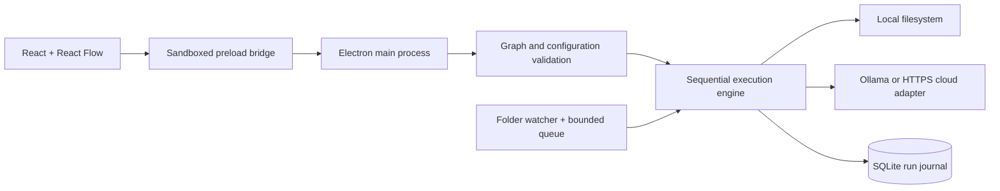

# Architecture and tradeoffs

Relay Studio is a local desktop workflow engine with a visual editor. React Flow supplies the canvas; it does not execute workflows. The application owns the graph format, runtime, permissions, persistence, and recovery behavior.

## Boundaries

The renderer has no Node.js or filesystem access. IPC verifies the sending frame and its local page URL. Native folder pickers create persistent canonical-folder grants. Manual input files require a file-picker grant for the current session. Imported recipes have all folder fields reset. Exported recipes omit folder paths and never contain connection credentials.

The Content Security Policy blocks renderer network access, remote scripts, frames, and embedded objects. All AI networking happens in the main process. Navigation and new windows are blocked.

## Graph semantics

Each workflow has one trigger and at most 40 steps. A normal output has one successor; conditions have separate Yes and No outputs. An unconnected condition output ends that path successfully. Cycles, joins, duplicate IDs, and multiple successors on the same output are rejected. Drafts may contain disconnected steps, but execution requires every step to be reachable from the trigger.

One run executes at a time. Each run captures the workflow version, source path, mode, timestamps, per-step input/output, duration, and file effects. Edits do not rewrite history. The UI reads snapshots and receives update events through IPC. Cancel aborts an AI request or stops before the next step; file operations already in progress finish.

## Preview

Preview reads and extracts the selected file, evaluates deterministic conditions, and resolves filenames. It performs no file writes, notifications, or AI requests. AI-dependent output is explicitly unresolved. If an AI-dependent branch or rename prevents a reliable downstream plan, preview stops rather than inventing data.

A successful preview is a simulation result, not proof that an AI provider is configured or that a subsequent real run will succeed. Files and permissions may change between preview and execution.

## Files and recovery

Supported operations are copy, move, rename, and exclusive text-file creation. Existing destinations are never overwritten. Filenames reject separators, traversal, control characters, and Windows reserved names. Symbolic-link inputs are rejected by the engine. Each file has a 25 MB input limit.

Moves use exclusive copy, hash verification, and source removal, supporting cross-volume moves. Effects are recorded in SQLite as execution progresses. Undo walks those effects backwards, verifies content hashes, refuses conflicting restore paths, and persists partial undo progress. Modified files are not removed by undo. Notifications and AI requests cannot be reversed.

Filesystem operations and SQLite updates are not one transaction. A process or power failure between a filesystem operation and its journal update can leave an unjournaled effect. Interrupted runs are marked on startup; inspect their paths before rerunning. This version does not claim crash-atomic or exactly-once filesystem execution. It also cannot eliminate races caused by other programs editing the same files concurrently.

## Watching

Chokidar watches only files directly inside the chosen folder. Existing files are ignored and new files must stabilize for 1.5 seconds. Symbolic links are not followed. A bounded queue holds up to 100 arrivals and runs them sequentially; an overflow notification tells the user to process missed files manually.

Watchers start paused after restart. Editing a watched workflow pauses it. Watching does not run when the application is closed. A move must precede a rename in watched workflows, outputs must be outside their source folder, and chains between active watched folders are blocked to avoid loops. Queue contents are not persisted across restarts. A failed run remains in history; no automatic retry risks repeating effects.

## AI

Ollama is restricted to loopback addresses. Cloud providers must use HTTPS and the OpenAI-compatible Chat Completions schema. Redirects are rejected. Cloud document processing requires an explicit setting. Requests have a 120-second timeout and a 60,000-character text limit.

API keys are encrypted using Electron safeStorage and are never returned to the renderer. Insecure plaintext storage backends are rejected. Changing the endpoint without supplying a replacement key clears the old key. Model names are entered explicitly; the app does not download models or subscribe users to services.

Structured output requires user-selected string fields. Missing fields or invalid JSON fail the step. Model output cannot execute tools or shell commands. It can influence configured templates, where safe filename checks still apply. Empty field values are allowed and should be considered when designing naming patterns.

## Storage and limits

SQLite uses WAL mode. Workflow saves and run-journal updates are individual database transactions. The history UI shows the latest 100 runs; older records remain on disk. Document excerpts (up to 5,000 characters per step), paths, and prompts are stored locally in plaintext. Credentials are encrypted, not the entire workspace. Quit the application before backing up the user-data directory, including any remaining WAL files.

The core is intentionally small: no scheduling, arbitrary scripts, parallel branches, loops, spreadsheet connector, OCR, cloud synchronization, or team accounts. These are extensions, not implemented features. Windows is the tested distribution target.
