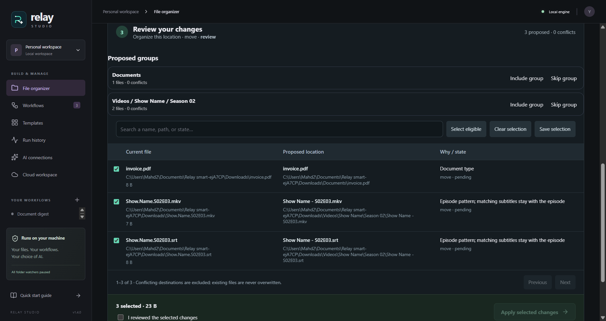

# Five-minute demo

## Organize an existing collection

1. Make a personal test folder containing a PDF, three pictures named `Trip-001.jpg` through `Trip-003.jpg`, and a video named `Show.S01E02.mkv`.
2. Open **File organizer → Organize this location**, and browse to that folder. Leave **Create folders inside this location** selected.
3. **Scan files**, then **Build review**. Expect groups for `Documents`, `Pictures/Trip`, and `Videos/Show/Season 01`.
4. Uncheck one file. Confirm that no output exists yet, acknowledge the selected changes, and **Apply selected changes**.
5. Use **Undo batch**. The original files return, and Relay removes folders it created if they are empty.
6. Select **Bulk rename**, scan again, and try `{{number}}-{{stem}}{{ext}}`. The review shows every proposed name before you apply it.
7. For a conflict demonstration, place a file at one proposed destination before building a new review. That item is marked conflicting and excluded.

Switch to **Organize with AI** to let your connected model improve document topics and names. Local grouping still runs first. AI uses document text, not visual understanding of photos. Saved plans and batches are accessible at the bottom of the page and survive app restarts.

## Automate new arrivals

1. Create two temporary folders, `Inbox` and `Archive`, and put a sample PDF in `Inbox`.
2. Open **Download organizer**. Select **A download arrives** and choose `Inbox` with the folder picker.
3. Select **Move to my archive** and choose `Archive`. Save the workflow.
4. Choose **Test workflow**, select the sample PDF, and **Preview workflow**. Expand a step in Executions to inspect its planned output. Both folders remain unchanged.
5. Choose **Test workflow → Run workflow**. The PDF moves to `Archive` and gains a date prefix.
6. Choose **Undo files**. The original filename and location are restored, provided the file was not edited.
7. Enable watching and copy a different PDF into `Inbox`. After the file stabilizes, the workflow runs automatically. Pause watching when done.
8. Open **Run history** and inspect the manual and watched runs.

To organize files that are already present, open the same workflow and choose **Organize existing folder**. Pick `Inbox`, enable **Include files inside subfolders** if needed, preview the batch, then run it. Relay processes the files one at a time, skips the configured archive folder, and records each file as its own run. Pause watching before starting the batch.

For an AI demonstration, configure an installed Ollama model or a cloud API key in **AI connections**, then use **Document digest** with a text-based PDF and a separate output folder. Preview intentionally skips AI. A real run produces a Markdown summary. Cloud runs transmit extracted text to the chosen provider.

For a failure demonstration, process a file whose target name already exists. Relay stops with a collision error and preserves both files. This illustrates failure handling rather than a simulated success state.

## Try the specialized templates

- **Exact duplicate review:** put two differently named copies of the same file in the source. Choose an archive destination. The review retains one source and identifies the extra by content hash; choose a preferred keep folder to change the retained location.
- **Verify a backup:** make an output containing one matching file and one different file. Build a review. Matching files are skipped, missing files are proposed for copying, and the different file is flagged without an overwrite.
- **Prepare a delivery:** build the plan, deselect a file, then Save selection. Expand the manifest's generated-file preview and check that it contains only selected files.
- **Receipt register:** configure your model, select a folder with a text receipt, and build a review. Confirm the model request, expand the generated JSON, then apply or leave the files untouched. Try a scanned image to exercise bundled English OCR.
- **Scheduled reviews:** save a no-AI setup, enable its interval, and keep Relay open with watchers paused. It prepares a review when due. Use Prepare review now to test immediately; neither path applies the plan automatically.
